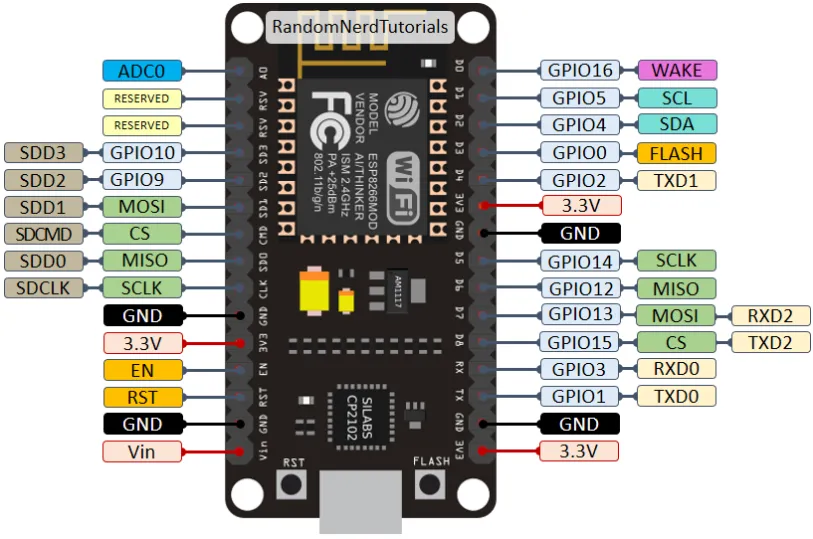

# X-Lights Workshop

This document is alive! If you spot a mistake or have a suggestion for its improvement send us a PR.

Learn programming with WS2812 ligthts and microcontroller!

# Prerequisites

## Hardware

- Board with ESP32 or ESP8266 chip (other microcontrollers such as Arduino or STM32 should work too)
- Solderless breadboard
- Wires for connections
- Neopixel LED stripe - WS2812, WS2812B or WS2811 will do
- DC power sources 5V/12V (up to 12V can be used to power the lights, but NOT the ESP, which has to be powered via USB in such a case!)
- Micro USB cable for connecting microcontroller with PC

(optionally)
- 1 mF capacitor
- 470 resistor

## Software

You will need to install [Python](https://www.python.org/downloads/) and pip on your computor. There is bunch of different tools in Python which can help us to use ESP microcontroller. To make it easier, we can use GUI IDE called [Thonny](https://thonny.org/). 

You can simply install it with pip for example:
```
pip3 install thonny
```
Other command tools installable with pip which can be helpfull are:

- esptool (flashing firmware)
- adafruit-ampy (copying, executing files)
- picom (terminal REPL prompt)

## Firmware
For this workshop, we will use [Micropython][micropython] enviroment. Download newest Micropython firmware suitable for your microcontroller. For example [here for ESP8266](https://micropython.org/download/esp8266/). 

# Preparing microcontroller

## GUI

Using Thonny, first go to `Tool -> Options -> Interpreter`. 
Here pick interpreter with Micropython for your chip and click on `Install or update firmware`. Make sure microcontroller is connected and pick USB port to communicate with it. Choose downloaded firmware from your drive and install it on microcontroller. This will take few seconds or minutes and your device is ready to be run code in Micropython. 

## Command line

Connect the microcontroller to your computer via data-USB cable. In the GNU/Linux it should appear as a port addressable by /dev/ttyUSB0.

To be in the same starting situation, we erase all the flash memory as
```
esptool.py --port /dev/ttyUSB0 erase_flash
```
Then we can upload the micropython firmware downloaded (e.g. espXXXX.bin) using:
```
esptool.py --chip esp32 --port /dev/ttyUSB0 write_flash -z 0x1000 espXXXX.bin
```

To get the micropython command line prompt we can use picocom
```
picocom /dev/ttyUSB0 --baud 115200
```

To upload, download, run code or act on the micro-Python file system run ampy, e.g.
```
ampy --port /dev/ttyUSB0 --baud 115200 put color.py
ampy --port /dev/ttyUSB0 --baud 115200 run ws2812.py
```
The boot.py or main.py will be run on the startup.

## Wiring and connecting lights

Place microcontroller on the breadboard, connect to computer and now let's connect Neopixel lights. 
* Ground (GND) of the microcontroller board and negative potential of lights power supply has to be connected. 
    * Make sure to connect these, otherwise, the signal won't get through properly and the lights will be incontrollable.
* Connect data wire to one of pin outputs on the board, for example D2.
    * Reffer to pinout
    * Optionally use small (300-500ohm) resistor between data wire and pin
* Coonect LEDs to power supply and optionally put capacitor between potentials

Now everything should be setup to blink your LEDs. 

## Hello Lights


To start with the lights we follow [the manual][upy] in Micropython documentation. According this manual the lights use the Machine pin 4, which can be found in ESP2812 pinout image to be D2.



[upy]: https://docs.micropython.org/en/latest/esp8266/tutorial/neopixel.html

```
>>>>>>> bordel/main
from machine import Pin
from neopixel import NeoPixel

N = 50                  # number of LED in the chain
pin = Pin(4, Pin.OUT)   # set GPIO4 to output to drive NeoPixels
np = NeoPixel(pin, N)   # create NeoPixel driver on GPIO0 for 8 pixels
np[0] = (255, 255, 255) # set the first pixel to white
np.write()              # write data to all pixels
r, g, b = np[0]         # get first pixel colour
```
After running the code you can see that the LED number 0 (i.e. the first one) is turned on white. This is because `np[0]` represents the first pixel of the variable `np` (number 0).

Actually every LED is composed of three colors that have intensity between 0 and 255 (i.e. codified by 8 bits). The line `np[0] = (255,255,255)` encodes the maximal intensity in order of (green, red, blue) colors.

Finally, the colors are written by `np.write()`.

To explain the functionality of the code, the programmers write comments. Those are texts that are not executed but make the understanding of the code easier. In Python the comments starts with a hash sign `#`.

Exercise: So, let's try it. Set the LED number 3 green, LED number 4 blue and LED number 5 red.

## Turn on All

Now lets setup a color of the whole chain to be pink, which is encoded as `pink = (0,255,50)`. Although, we could technically write for all `np[0]` untill `np[N-1]` by hand, it's convenient to use loops as follows:

```python
for i in range(N):
	np[i] = pink
np.write()
```
which setsup a list `range(N)` that will get the values `[1, 2, ..., N-1]`. Also, a new variable `i` will be initiated. During the iterations of the loop the `i` will get assigned to the values of the list one by one. So the pink color (that is a variable set before the loop) gets assigned.

Note, that in python only the part that is indented to the same level belongs to the loop. The `np.write()` is then executed after the loop finishes.

Exercise: turn all the LED blue.

## Blink

The next excercise we can do now is to blink with a LED. For that we turn the LED on and off with some spare time in between. For the spare time we need to let the execution wait for some time. For this purpose we use the library `time` that is imported to python ideally at the top of the code (for better readibility) by `import time`. Then we can run the function `time.sleep_ms(x)` to stop the execution for `wait` ms.

 So we prepare the following code

```python
import time
from machine import Pin
from neopixel import NeoPixel

N = 50
pin = Pin(4, Pin.OUT)
np = NeoPixel(pin, N)

T = 2000.0
while True:
	np[0] = pink
	np.write()
	time.sleep_ms(T/2)
	np[0] = (0,0,0)
	np.write()
	time.sleep_ms(T/2)
```

Here the `while True` keywords is just another type of the loop. It is executed while the condition behind is true. As our condition is always `True`, we have created an infinite loop.


Exercise: blink with the whole chain. 

Hint: create two nested loops as we saw in the previous exercise to change all the colors of the LED. Make sure that the indentation level matches.

## Functions -- Blinking Multiple Colors

In the previous exercise we have changed the colors of the whole chain twice. This means that some of the code might be repeated. In programming we are trying to avoid that, as if we make a mistake within the repeated code, we would need to correct the mistake in all the corresponding places. Instead we use so called functions.

Functions are special pieces of code that can be called from other places in the program. We have already came across some functions such as `np.write()`, `time.sleep_ms(wait)` etc. Here the first function does not take any input arguments. The second takes one input argument `wait` that says how many miliseconds the program should sleep. Those funcions were imported from other libraries and we actually don't need to know how exactly they do their stuff (although, as the source code is available we could technically do that).

The functions are defined using the `def` keyword and then completed with the stuff they do, such as:
```python
def setSolid(color):
    for i in range(N):
        np[i] = color
    np.write()
```
This particular function takes one input argument called color. This has to be provided at the place where the function is called from, otherwise the program will fail. One demonstration of calling this function is:
```python
dimmed_red = (0,128,0)
setSolid(dimmed_red)
```

Excercise: blink with the whole chain using functions.

Advanced: call it within a function `blink_chain()` that contains all the required code.

## Colors

Our specification of the colors is GRB (green, red, blue). Although, for the LED that contains just those three colors it is easy to understand this, it is somehow counterintuitive for a human to work with this color schema. For that purpose a [HSL (hue, saturation, lightness)][hsl] is used. We can imagine the colors to be placed on a color circle and changing color (hue) according to it's possition. 

In this way we can obtain a continuous color schema dependent only on one variable (hue) instead of three, as it is the case with GRB. Also, we can dim the lights changing lightness variable or we can alter the saturation of the color.

[hsl]: https://en.wikipedia.org/wiki/HSL_and_HSV

To use this color schema define the following function in your code:
```
def hsv_to_grb(h, s, v):
    if s == 0.0: return (tohex(v), tohex(v), tohex(v))
    i = int(h*6.) # XXX assume int() truncates!
    f = (h*6.)-i; p,q,t = v*(1.-s), v*(1.-s*f), v*(1.-s*(1.-f)); i%=6
    if i == 0: return (tohex(t), tohex(v), tohex(p))
    if i == 1: return (tohex(v), tohex(q), tohex(p))
    if i == 2: return (tohex(v), tohex(p), tohex(t))
    if i == 3: return (tohex(q), tohex(p), tohex(v))
    if i == 4: return (tohex(p), tohex(t), tohex(v))
    if i == 5: return (tohex(p), tohex(v), tohex(q))
```

Here you can see another property of a function -- return value. That is a value the function will return back to the place where the code was executed from. There it can be assigned to a variable as:
```python
mycolor = hsv_to_grb(0.25,1,0.2)
np[0] = mycolor
```
or passed directly to another function such as:
```python
setSolid(hsv_to_grb(0.25,1,0.2))
```

Excercise: setup the chain to rainbow colors.

Hint: use `hsv_to_grb` function dependent of the loop variable

## Making the program

So now you probably have completed a number of function that you might like to execute when the microcontroller is powered up. By default the microcontroller runs the code in `boot.py` that starts `main.py` function. So if you place the code in one of those, it will work.

For that we need to upload the files to the microcontroller. In the command line this is done via `ampy` as:
```bash
ampy --port /dev/ttyUSB0 --baud 115200 put main.py
```
In this repository you can find a file `ws2812.py` that contains some further functions and code for you to play with.

# End?

Thank you for reading up to here. We hope you have enjoyed the workshop and will continue having a lot of fun with your lights. Feel free to experiment with the code further. Send us your questions, feedback or perhaps pull requests for new cool features. We look forward for them! ;)

If you wish to support us, you can do so via (Mario??)


[Tomas](mailto:tomas@stary.co.uk)

[Mario](??)
